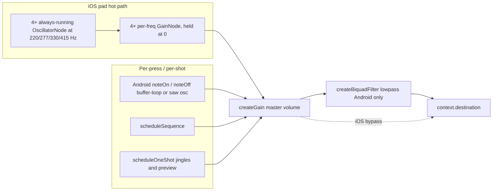

# Audio architecture (game tones)

This document describes how **Eco Mi** produces pad tones, sequence playback, jingles, and settings previews. It reflects the post–spike-refactor stack in [`src/hooks/useAudioTones.tsx`](../src/hooks/useAudioTones.tsx) and [`src/utils/audio/padBufferVoice.ts`](../src/utils/audio/padBufferVoice.ts).

## Goals

- **Consistent feel** on device: pads and preview should match closely what users hear when evaluating sound packs (purchase consideration).
- **Per-frequency isolation**: each color has a fixed game frequency; voices do not share one `AudioParam` for overlapping automation.
- **No per-press node creation on iOS** (pad hot path): always-running oscillator pool gated by per-frequency gain, so `noteOn`/`noteOff` are pure linear ramps. Restores the v1.1.0 design after `react-native-audio-api` ≥ 0.12.0 was found to "rattle" on iOS with create-per-note + sub-quantum lookahead scheduling.
- **Reliable teardown** (Android per-press voices): gain release → disconnect → deferred `source.stop` so native runtimes do not pop on `stop()`.

## Signal graph (simplified)

- **Master gain** tracks user volume from preferences.
- **Biquad lowpass** (fixed corner ~6.8 kHz, **Android only**) softens harsh harmonics and smooths buffer-loop boundary transitions. It is not a product EQ control—tuning lives in code (`MASTER_TONE_LP_HZ` in `useAudioTones`). **iOS bypasses the filter entirely** and routes `master → destination`: with the iOS pool the filter sat in front of cold-starting transients and magnified envelope-zipper artifacts (the very fizz it was added to tame).

## `useAudioTones` responsibilities

| Concern | Behavior |
|--------|------------|
| **Pads (iOS)** | Always-running oscillator pool (`iosPadPoolRef`); `noteOn`/`noteOff` ramp per-freq gain. |
| **Pads (Android)** | `noteOn` / `noteOff` create per-press `AudioBufferSourceNode` (sine/sq/tri) or `OscillatorNode` (saw); per-frequency map `padByFreqRef` with retrigger and deferred teardown. |
| **Sequence** | `scheduleSequence` pre-schedules each step on the audio clock (lookahead + per-step start times). Sequence steps still create their own short-lived oscillators/buffer-sources rather than borrowing the iOS pool, so a holding pad and a sequence step at the same frequency don't collide on a single `AudioParam`. |
| **One-shots** | Jingles, game-over, high-score, and `playPreview` use `createOscillator` + short linear ramps. |
| **Context lifecycle** | `initialize` / `cleanup`, `recreateContext` on resume failure (rebuilds the iOS pool), `AppState` suspend; `onAudioContextRecycle` for analytics. |

## Pad voice: pool vs buffer vs per-press oscillator

| Platform | Sine / square / triangle | Buzzy (sawtooth) |
|----------|-------------------------|------------------|
| **iOS** | **Oscillator pool**: 4× always-running `OscillatorNode` per `POOL_FREQS`, gated by per-freq `GainNode` held at 0. `noteOn` ramps the gate up; `noteOff` ramps it down. No node creation on the hot path, no `source.stop()` between presses. Wave-type changes set `osc.type` in place (phase-continuous). | Same pool — `osc.type = "sawtooth"`. |
| **Android** | Looped `AudioBuffer` (period-aligned length in `createLoopingPadBuffer`) + per-press source + linear attack/release. | Per-press `OscillatorNode` so timbre matches settings preview. |

Rationale: the iOS pool was the v1.1.0 design and was reinstated after a per-`noteOn` create/teardown architecture (introduced during the anti-click spike) developed audible "rattle" on iOS with `react-native-audio-api` ≥ 0.12.0 — cold-start transients on per-note oscillators combined with a sub-quantum scheduling lookahead snapped the 0→peak attack ramp onto k-rate boundaries unevenly. Always-running oscillators have no cold start: `noteOn` is just `linearRampToValueAtTime` on a node that's already been rendering at zero gain. Android stayed on per-press because its buffer-loop path was working well and didn't share the symptom.

## Envelopes: why linear, not `setValueCurve` (Hann)

An earlier spike used **Hann half-cosine** curves via `setValueCurveAtTime` for attack and release. On real devices, that path was prone to **grain, rattle, or silence** depending on `react-native-audio-api` and OS audio. Production code uses **linear** ramps on gain (`linearRampToValueAtTime`) and **`scheduleLinearPadRelease`**, which still does **`cancelAndHoldAtTime`** before scheduling—matching the “safe automation” pattern without mixing curve and ramp on the same parameter.

## Android warm vs cold lookahead

`getPadBufferAttackParams` in `padBufferVoice` returns `attackLookaheadS` from wall-clock `lastPressInWallMs` vs `nowWallMs`:

- **Warm** (second tap within ~280 ms of last): shorter lookahead (snappier).
- **Cold** (or first tap): longer lookahead to reduce click risk on a cold code path.

Constants: `PAD_ATTACK_LOOKAHEAD_ANDROID_WARM_S`, `PAD_ATTACK_LOOKAHEAD_ANDROID_COLD_S`, `PAD_ANDROID_WARM_ENTRY_WINDOW_MS`. iOS pads no longer carry a per-press lookahead — the pool oscillators are already rendering, so `noteOn` ramps from `ctx.currentTime` directly.

## Peak level: preview and gameplay

Sustained pads and sequence steps use **`SUSTAIN_PAD_PEAK` = `DEFAULT_PAD_TARGET_GAIN * 0.8`**, the same factor as `playPreview`, so store/settings audition matches in-game level.

## Multiple `useAudioTones` instances

**Game** ([`useGameEngine`](../src/hooks/useGameEngine.ts)) and **Settings** ([`src/app/settings.tsx`](../src/app/settings.tsx)) each call `useAudioTones` with their own `AudioContext` when their screen is mounted. This is intentional: no global singleton, simpler than sharing one context across routes (at the cost of a second graph when both have initialized audio).

## Key files

| File | Role |
|------|------|
| [`src/hooks/useAudioTones.tsx`](../src/hooks/useAudioTones.tsx) | Pad/sequence/one-shot scheduling, buffer cache, master + tone filter. |
| [`src/utils/audio/padBufferVoice.ts`](../src/utils/audio/padBufferVoice.ts) | Loop buffers, `getPadBufferAttackParams`, `scheduleLinearPadRelease`, shared timing constants. |

## Testing

- **Unit tests** mock `useAudioTones` at the hook API in game engine tests; keep the public shape stable.
- **Device** manual checks:
  - **iOS**: first pad press from cold (no rattle on the attack), sustained pad held 1–2 s (clean steady tone), rapid pad mashing (clean retrigger via cancel-and-ramp on the pool gate), sound-pack switch mid-session (oscillator type updates phase-continuously), background → foreground (pool resumes via `ensureResumed`, no recreate needed unless suspend failed).
  - **Android**: rapid pad taps, cold vs warm taps, Buzzy pack vs Classic, sequence + pad in quick succession.

## Changelog

See **[Unreleased] → Docs / Refactor** in [CHANGELOG.md](../CHANGELOG.md) for entries tied to this document and the `padBufferVoice` cleanup.
