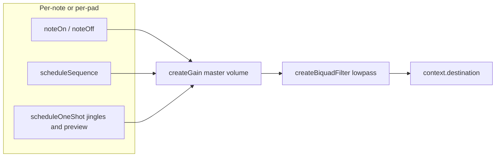

# Audio architecture (game tones)

This document describes how **Eco Mi** produces pad tones, sequence playback, jingles, and settings previews. It reflects the post–spike-refactor stack in [`src/hooks/useAudioTones.tsx`](../src/hooks/useAudioTones.tsx) and [`src/utils/audio/padBufferVoice.ts`](../src/utils/audio/padBufferVoice.ts).

## Goals

- **Consistent feel** on device: pads and preview should match closely what users hear when evaluating sound packs (purchase consideration).
- **Per-frequency isolation**: each color has a fixed game frequency; voices do not share one `AudioParam` for overlapping automation.
- **Reliable teardown**: gain release → disconnect → deferred `source.stop` so native runtimes do not pop on `stop()`.

## Signal graph (simplified)

- **Master gain** tracks user volume from preferences.
- **Biquad lowpass** (fixed corner ~6.8 kHz) softens harsh harmonics and reduces envelope “fizz” on iOS and Android. It is not a product EQ control—tuning lives in code (`MASTER_TONE_LP_HZ` in `useAudioTones`).

## `useAudioTones` responsibilities

| Concern | Behavior |
|--------|------------|
| **Pads** | `noteOn` / `noteOff` for idle + gameplay; per-frequency map `padByFreqRef`. |
| **Sequence** | `scheduleSequence` pre-schedules each step on the audio clock (lookahead + per-step start times). |
| **One-shots** | Jingles, game-over, high-score, and `playPreview` use `createOscillator` + short linear ramps. |
| **Context lifecycle** | `initialize` / `cleanup`, `recreateContext` on resume failure, `AppState` suspend; `onAudioContextRecycle` for analytics. |

## Pad voice: buffer vs oscillator

| Platform | Sine / square / triangle | Buzzy (sawtooth) |
|----------|-------------------------|------------------|
| **iOS** | `OscillatorNode` + linear attack/release (no looped buffer for pads). | Same: native `sawtooth`. |
| **Android** | Looped `AudioBuffer` (period-aligned length in `createLoopingPadBuffer`) + linear attack/release. | `OscillatorNode` so timbre matches settings preview. |

Rationale: native saw matches the same **Oscillator** path as the settings `playPreview`; a purely buffer-based saw was retired after device testing.

## Envelopes: why linear, not `setValueCurve` (Hann)

An earlier spike used **Hann half-cosine** curves via `setValueCurveAtTime` for attack and release. On real devices, that path was prone to **grain, rattle, or silence** depending on `react-native-audio-api` and OS audio. Production code uses **linear** ramps on gain (`linearRampToValueAtTime`) and **`scheduleLinearPadRelease`**, which still does **`cancelAndHoldAtTime`** before scheduling—matching the “safe automation” pattern without mixing curve and ramp on the same parameter.

## Android warm vs cold lookahead

`getPadBufferAttackParams` in `padBufferVoice` returns `attackLookaheadS` from wall-clock `lastPressInWallMs` vs `nowWallMs`:

- **Warm** (second tap within ~280 ms of last): shorter lookahead (snappier).
- **Cold** (or first tap): longer lookahead to reduce click risk on a cold code path.

Constants: `PAD_ATTACK_LOOKAHEAD_ANDROID_WARM_S`, `PAD_ATTACK_LOOKAHEAD_ANDROID_COLD_S`, `PAD_ANDROID_WARM_ENTRY_WINDOW_MS`. iOS sustained pads use a separate short lookahead (`PAD_IOS_SUSTAIN_LOOKAHEAD_S`).

## Peak level: preview and gameplay

Sustained pads and sequence steps use **`SUSTAIN_PAD_PEAK` = `DEFAULT_PAD_TARGET_GAIN * 0.8`**, the same factor as `playPreview`, so store/settings audition matches in-game level.

## Multiple `useAudioTones` instances

**Game** ([`useGameEngine`](../src/hooks/useGameEngine.ts)) and **Settings** ([`src/app/settings.tsx`](../src/app/settings.tsx)) each call `useAudioTones` with their own `AudioContext` when their screen is mounted. This is intentional: no global singleton, simpler than sharing one context across routes (at the cost of a second graph when both have initialized audio).

## Key files

| File | Role |
|------|------|
| [`src/hooks/useAudioTones.tsx`](../src/hooks/useAudioTones.tsx) | Pad/sequence/one-shot scheduling, buffer cache, master + tone filter. |
| [`src/utils/audio/padBufferVoice.ts`](../src/utils/audio/padBufferVoice.ts) | Loop buffers, `getPadBufferAttackParams`, `scheduleLinearPadRelease`, shared timing constants. |

## Testing

- **Unit tests** mock `useAudioTones` at the hook API in game engine tests; keep the public shape stable.
- **Device** manual checks: rapid pad taps, cold vs warm Android taps, Buzzy pack vs Classic, sequence + pad in quick succession.

## Changelog

See **[Unreleased] → Docs / Refactor** in [CHANGELOG.md](../CHANGELOG.md) for entries tied to this document and the `padBufferVoice` cleanup.
