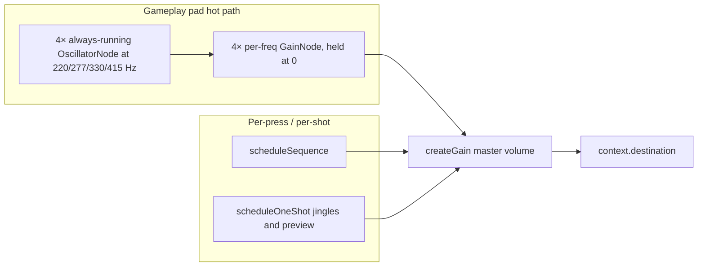

# Audio architecture (game tones)

This document describes how **Eco Mi** produces pad tones, sequence playback, jingles, and settings previews. It reflects the post–spike-refactor stack in [`src/hooks/useAudioTones.tsx`](../src/hooks/useAudioTones.tsx) and the platform-split helpers under [`src/utils/audio/`](../src/utils/audio/) (see [Key files](#key-files)).

## Goals

- **Consistent feel** on device: pads and preview should match closely what users hear when evaluating sound packs (purchase consideration).
- **Per-frequency isolation**: each color has a fixed game frequency; voices do not share one `AudioParam` for overlapping automation.
- **No per-press node creation on gameplay pads**: both iOS and Android use the v1.1.0 always-running oscillator pool gated by per-frequency gain, so `noteOn`/`noteOff` are pure linear ramps. Restores platform-equivalent pad behavior after per-press Android voices started crackling under rapid taps.
- **Reliable teardown** (sequence / one-shot voices): gain release and scheduled stop/disconnect keep non-pad playback bounded.

## Signal graph (simplified)

- **Master gain** tracks user volume from preferences.
- **No master biquad on the gameplay-pad test path**: both platforms route `master → destination` directly so Android can be compared against the same v1.1.0 pool behavior as iOS.

## `useAudioTones` responsibilities

| Concern | Behavior |
|--------|------------|
| **Pads (iOS + Android)** | Always-running oscillator pool (`padOscPoolRef`); `noteOn`/`noteOff` ramp per-freq gain. |
| **Sequence** | `scheduleSequence` pre-schedules each step on the audio clock (lookahead + per-step start times). Sequence steps still create their own short-lived oscillators/buffer-sources rather than borrowing the gameplay pad pool, so a holding pad and a sequence step at the same frequency don't collide on a single `AudioParam`. |
| **One-shots** | Jingles, game-over, high-score, and `playPreview` use `createOscillator` + short linear ramps. |
| **Context lifecycle** | `initialize` / `cleanup`, `recreateContext` on resume failure (rebuilds the pad pool), `AppState` suspend; `onAudioContextRecycle` for analytics. |

## Pad voice: pool vs buffer vs per-press oscillator

| Platform | Sine / square / triangle | Buzzy (sawtooth) |
|----------|-------------------------|------------------|
| **iOS** | **Oscillator pool**: 4× always-running `OscillatorNode` per `POOL_FREQS`, gated by per-freq `GainNode` held at 0. `noteOn` ramps the gate up; `noteOff` ramps it down. No node creation on the hot path, no `source.stop()` between presses. Wave-type changes set `osc.type` in place (phase-continuous). | Same pool — `osc.type = "sawtooth"`. |
| **Android** | Same oscillator pool as iOS for this test build. | Same pool — `osc.type = "sawtooth"`. |

Rationale: the iOS pool was the v1.1.0 design and was reinstated after a per-`noteOn` create/teardown architecture (introduced during the anti-click spike) developed audible "rattle" on iOS with `react-native-audio-api` ≥ 0.12.0 — cold-start transients on per-note oscillators combined with a sub-quantum scheduling lookahead snapped the 0→peak attack ramp onto k-rate boundaries unevenly. Android later showed a similar rapid-tap crackle on the per-press buffer/oscillator path, so gameplay pads now use the same pool on both platforms. Always-running oscillators have no cold start: `noteOn` is just `linearRampToValueAtTime` on a node that's already been rendering at zero gain.

## Envelopes: why linear, not `setValueCurve` (Hann)

An earlier spike used **Hann half-cosine** curves via `setValueCurveAtTime` for attack and release. On real devices, that path was prone to **grain, rattle, or silence** depending on `react-native-audio-api` and OS audio. Production code uses **linear** ramps on gain (`linearRampToValueAtTime`) and **`scheduleLinearPadRelease`**, which still does **`cancelAndHoldAtTime`** before scheduling—matching the “safe automation” pattern without mixing curve and ramp on the same parameter.

## Android warm vs cold lookahead

`getPadBufferAttackParams` in [`androidPadBuffer`](../src/utils/audio/androidPadBuffer.ts) remains for Android buffer experiments and sequence-path tuning, but gameplay pads no longer call it. The old per-press Android pad path returned `attackLookaheadS` from wall-clock `lastPressInWallMs` vs `nowWallMs`:

- **Warm** (second tap within ~280 ms of last): shorter lookahead (snappier).
- **Cold** (or first tap): longer lookahead to reduce click risk on a cold code path.

Constants: `PAD_ATTACK_LOOKAHEAD_ANDROID_WARM_S`, `PAD_ATTACK_LOOKAHEAD_ANDROID_COLD_S`, `PAD_ANDROID_WARM_ENTRY_WINDOW_MS`. Gameplay pads no longer carry a per-press lookahead — the pool oscillators are already rendering, so `noteOn` ramps from `ctx.currentTime` directly.

## Peak level: preview and gameplay

Sustained pads and sequence steps use **`SUSTAIN_PAD_PEAK` = `DEFAULT_PAD_TARGET_GAIN * 0.8`**, the same factor as `playPreview`, so store/settings audition matches in-game level.

## Multiple `useAudioTones` instances

**Game** ([`useGameEngine`](../src/hooks/useGameEngine.ts)) and **Settings** ([`src/app/settings.tsx`](../src/app/settings.tsx)) each call `useAudioTones` with their own `AudioContext` when their screen is mounted. This is intentional: no global singleton, simpler than sharing one context across routes (at the cost of a second graph when both have initialized audio).

## Key files

| File | Role |
|------|------|
| [`src/hooks/useAudioTones.tsx`](../src/hooks/useAudioTones.tsx) | Orchestrator: context lifecycle, AppState handling, master gain (+ Android-only biquad), pad / sequence / one-shot routing, retrigger handling. |
| [`src/utils/audio/padShared.ts`](../src/utils/audio/padShared.ts) | Cross-platform constants (`POOL_FREQS`, `ONE_SHOT_ATTACK_S`, `PAD_RELEASE_S`, `SUSTAIN_PAD_PEAK`, sequence timing) and `scheduleLinearPadRelease`. |
| [`src/utils/audio/padOscPool.ts`](../src/utils/audio/padOscPool.ts) | Cross-platform gameplay pad pool helpers: `buildPadOscPool`, `teardownPadOscPool`, `setPadOscPoolWave`, `silencePadOscPool`, `padOscPoolNoteOn`, `padOscPoolNoteOff`. |
| [`src/utils/audio/androidPadBuffer.ts`](../src/utils/audio/androidPadBuffer.ts) | Android buffer creation (`createLoopingPadBuffer`, `padBufferCacheKey`) and old warm/cold lookahead constants kept for sequence-path tuning / comparison experiments. |

## Testing

- **Unit tests** mock `useAudioTones` at the hook API in game engine tests; keep the public shape stable.
- **Device** manual checks:
  - **iOS**: first pad press from cold (no rattle on the attack), sustained pad held 1–2 s (clean steady tone), rapid pad mashing (clean retrigger via cancel-and-ramp on the pool gate), sound-pack switch mid-session (oscillator type updates phase-continuously), background → foreground (pool resumes via `ensureResumed`, no recreate needed unless suspend failed).
  - **Android**: rapid pad taps, Buzzy pack vs Classic, sequence + pad in quick succession.

## Changelog

See **[Unreleased] → Docs / Refactor** in [CHANGELOG.md](../CHANGELOG.md) for entries tied to this document, the pool restoration, and the `padBufferVoice → padShared + padOscPool + androidPadBuffer` split.
