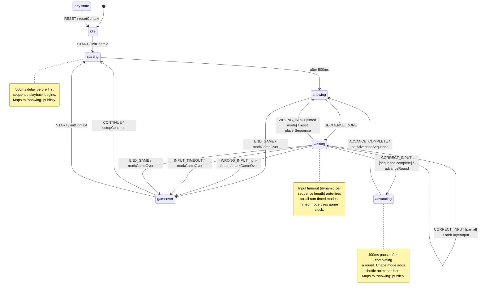

# Game Engine State Machine

Visual representation of the XState machine defined in `src/hooks/gameEngineMachine.ts`. Renders on GitHub via Mermaid.

## State Diagram

## State → Public API Mapping

| Internal State | Public `gameState` | Description |
|---|---|---|
| `idle` | `"idle"` | Home screen, waiting to start |
| `starting` | `"showing"` | 500ms delay before sequence begins |
| `showing` | `"showing"` | Computer playing the sequence |
| `waiting` | `"waiting"` | Player's turn to repeat |
| `advancing` | `"showing"` | Brief pause between rounds |
| `gameover` | `"gameover"` | Game ended, score displayed |

## Events

| Event | From | To | Description |
|---|---|---|---|
| `START` | idle, gameover | starting | Begin a new game |
| `SEQUENCE_DONE` | showing | waiting | Computer finished playing sequence |
| `CORRECT_INPUT` | waiting | waiting/advancing | Player tapped correct color |
| `WRONG_INPUT` | waiting | gameover/showing | Player tapped wrong color |
| `INPUT_TIMEOUT` | waiting | gameover | Player idled too long |
| `TIMER_EXPIRED` | waiting | gameover | Timed mode 60s clock hit zero |
| `END_GAME` | showing, waiting | gameover | Player tapped End Game |
| `CONTINUE` | gameover | starting | Rewarded ad continue |
| `ADVANCE_COMPLETE` | advancing | showing | Next round sequence ready |
| `RESET` | any | idle | Return to home screen |

## Bug Prevention

1. **isNewHighScore reset on continue** — `setupContinue` action on `CONTINUE` event explicitly sets `isNewHighScore: false`. No code path from gameover via continue can skip this.

2. **Input timeout for all modes** — `waiting` state has a dynamic `after` delay that fires for all non-timed modes. Timed mode returns `Infinity` (effectively disabled since the game clock handles gameover).

3. **No button interaction during showing** — `showing` state does not accept `CORRECT_INPUT` or `WRONG_INPUT` events. The wrapper rejects input when the machine is in `showing` state.
